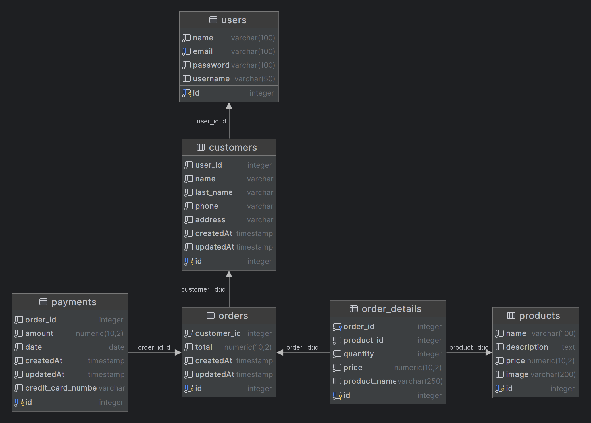

# Prueba Tecnica Miguel Martinez

Este proyecto consta de una arquitectura de microservicios desarrollada en NestJS, que proporciona una solución escalable y modular para una aplicación de carrito de compras. Los microservicios se comunican a través de TCP y están organizados en directorios separados dentro del repositorio.

## Estructura del Proyecto

El repositorio contiene los siguientes directorios principales:

- **api-gateway:** Este proyecto actúa como puerta de entrada para los microservicios, encargándose de enrutar las solicitudes a los servicios correspondientes.
- **authentication-microservice:** Microservicio encargado de la autenticación y autorización de usuarios.
- **customers-microservice:** Microservicio que maneja la gestión de clientes.
- **orders-microservice:** Microservicio responsable de la gestión de órdenes de compra.
- **payments-microservice:** Microservicio encargado del procesamiento de pagos.
- **products-microservice:** Microservicio que gestiona los productos disponibles.

Cada microservicio sigue una estructura similar, que incluye directorios como src, test, env-templates, entre otros. Dentro del directorio src, encontrarás módulos y controladores específicos para cada microservicio.

## Requisitos Previos

- Node.js (versión 20)
- npm (Administrador de paquetes de Node.js)

## Instalación y Configuración

1. Clona el repositorio en tu máquina local.
2. Navega al directorio raíz del proyecto.
3. Copia el contenido del archivo `.env.template` en un nuevo archivo `.env` en el directorio raíz. Este archivo contendrá las variables de entorno necesarias, como el puerto y el host para cada microservicio.
4. Instala las dependencias para cada microservicio ejecutando el siguiente comando en el directorio raíz:

    ```bash
    npm install
    ```

5. Crea la base de datos y las tablas necesarias ejecutando el script SQL proporcionado en el archivo `database-script`.

## Ejecución

- Inicia cada microservicio ejecutando el siguiente comando en sus respectivos directorios:

    ```bash
    npm run start
    ```

- Una vez que todos los microservicios estén en ejecución, inicia el proyecto `api-gateway` ejecutando el siguiente comando en su directorio:

    ```bash
    npm run start
    ```

## Documentación Swagger

La documentación Swagger está disponible en la ruta `host:puerto/docs` para cada microservicio. Proporciona una interfaz interactiva para explorar y probar los endpoints disponibles.

## Colección de Postman

Se incluye un archivo `API GATEWAY.postman_collection` que contiene una colección de Postman con todos los endpoints disponibles. Puedes importar esta colección en Postman para probar los endpoints de forma rápida y sencilla.

## Usuarios de prueba

Los siguientes usuarios están disponibles para la autenticación:

- Usuario: jane, Contraseña: 12345678
- Usuario: john, Contraseña: 12345678
- Usuario: mike, Contraseña: 12345678

## Diagrama de Base de Datos

A continuación se muestra el diagrama de la base de datos del sistema:


